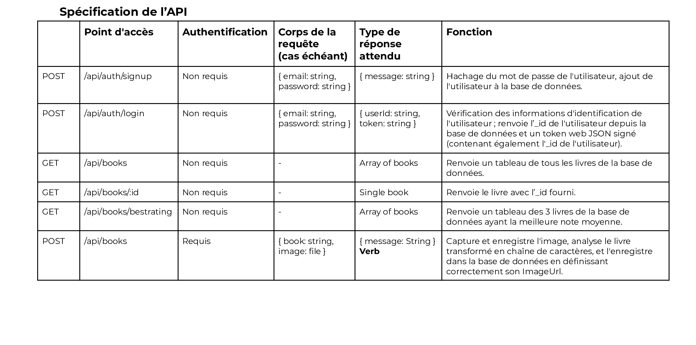
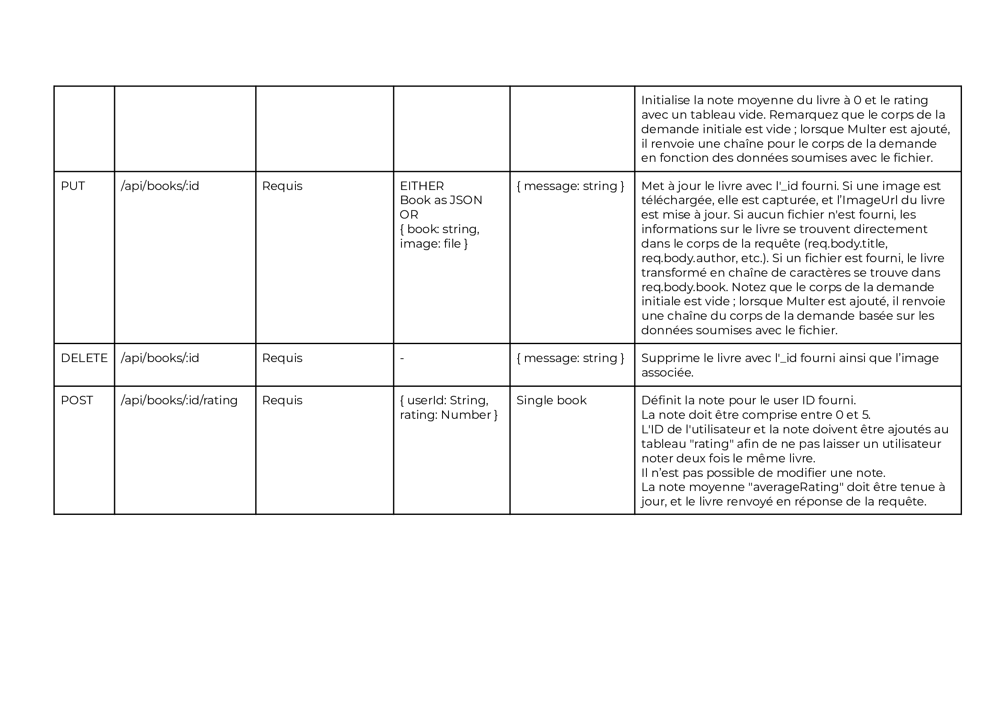
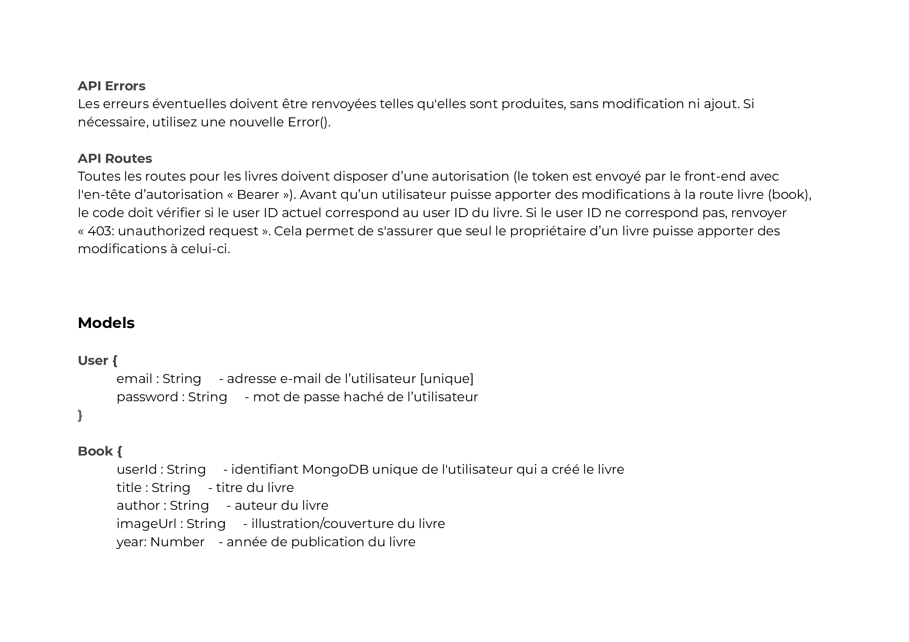
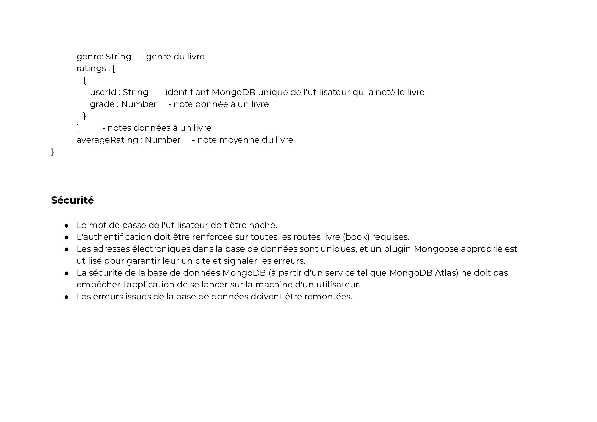

# Contexte du projet 

Je suis développeur back-end freelance depuis maintenant un an dans la région de Lille. J'ai l’habitude de travailler avec Kévin, un développeur front-end plus expérimenté que moi, qui possède un bon réseau de contacts dans le milieu.

Kévin m'a contacté pour me proposer de travailler avec lui en mutualisant nos compétences front-end et back-end sur un tout nouveau projet. Il s’agit d’une petite chaîne de librairies qui souhaite ouvrir un site de référencement et de notation de livres.

## Objectif du projet

L'objectif principal de ce projet est de développer le back-end de cette application.

## Spécifications Techniques

Voici les spécifications techniques du projet :






## Installation
Pour installer les dépendances nécessaires, exécutez la commande suivante à la racine du dossier :
```bash
#pour installer les dépendances du fichier package.json
npm install
# puis pour lancer le serveur
nodemon server